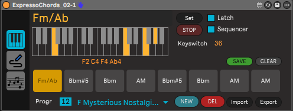

![A black and white photograph of soft shadows from leaves.][image1]

# 

# 

# **The Creative Workflow Suite**

Tools for Ableton Live/M4L MIDI Device  
*Requires Ableton Live Standard/Suite with Max4Live*

**FLUX** is a collection of tools designed to break down the barriers between music theory and production, transforming simple ideas into complete arrangements.

# Devices

| Device | Modules | Description |
| :---- | :---- | :---- |
| **FLUXProgression** | **FLUXSequencer FLUXGenerator FLUXTransport** | Chords Progressions Manager and Sequencer |
| **FLUXArticulator** |  | Chord Articulator |
| **FLUXSteps** |  | Step Sequencer |

**FLUXProgressions** is 

- a relational database of chord progressions;  
- a chord builder to input directly your custom progression  
- an intuitive interface in order to customize your progression  
- 

Also available is the chords progression generator **FLUXGenerator** based on different parameters;

But not just a chord progression manager/generator, but a rhythmic builder with **FLUXSequencer**. Thanks to the 8-step sequencer, you can inject groove into your progressions by controlling the accent (velocity) and duration of every single chord.

With **FLUXTransport** you can control the current progression played with current chord / next chord to be played info and the current song time all in a floating window in order to improve your live/recording performance.

Forget manual note drawing. **FLUXArticulator** transforms your chords into dynamic articulations, creating instant melodic movement that responds perfectly to harmonic changes.

**FLUXSteps** is an advanced step sequencer that generates sequences based on current chords played by **FLUXSequencer** in order to create unique sequences with probability, velocity and extra data to create advanced and mutating (option) sequences.

## FLUXProgressions

![][image3]  
Main module to create a progression of up to 8 Chords. Progression can be created by:

* Select one of the almost 2000 ready progressions by style (DB)   
* Custom progression Builder by MIDI Input (Keyboard)  
* Generate progressions with **FLUXGenerator**

Extra features:

* Create/Save a new progression  
* Create new progressions collection  
* Import/Export collection of progressions  
  

## ![][image4] 	FLUXGenerator

![][image5]  
This module generates a new progression based on:

* Root Note  
* Style  
* Scale (major/minor)  
* Total chords to generate  
* Variant (1st inversion / 2nd inversion / wide / widest)  
* Root Bass / Velocity limits

## ![][image6]	FLUXSequencer

![][image7]

* Up to 8 Steps Chord Sequence based on the current progression  
* Step Duration (1/128 \- 8/1)  
* Step Velocity (0 \- 127\)  
* Chords List   
* Current song time / tempo

Options

* Random velocities  
* Global step duration (1/128 \- 8/1)  
* Save Sequence (Pattern) to easy recall/switch  
* Floating song time/tempo and current ► next chord played (**FLUXTransport**)

## FLUXTransport

![][image8]  
Floating window with the following info:

* Current Chord played  
* Next Chord to be played  
* Current song transport time (bars/beats/ticks)  
* Current song tempo  
* List of the sequencer chords to be played

## 	FLUXArticulator (device)

![][image9]   ![][image10]

This module is a separate device that can be used in any track when FLUXProgressions is loaded. This gives you the possibility to articulate the current played chord with the following articulation:

- Arp Up  
- Arp Down  
- Arp Up/Down  
- Arp Random  
- Strum Up  
- Strum Down  
- Roll  
- Ping-Pong  
- Custom

The Custom mode plays the chord following the grid input.   
![][image11]  
The grid input is active only in Custom mode.

## FLUXSteps

![][image12]

